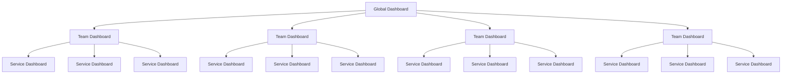

# Dashboard diagram

This doesn't really fit with the other stuff but oh well...

```mermaid
graph TD
    %% Global Dashboard
    A[Global Dashboard] 

    %% Team Dashboards
    A --> B1[Team Dashboard]
    A --> B2[Team Dashboard]
    A --> B3[Team Dashboard]
    A --> B4[Team Dashboard]

    %% Service Dashboards for each Team Dashboard
    B1 --> C1_1[Service Dashboard]
    B1 --> C1_2[Service Dashboard]
    B1 --> C1_3[Service Dashboard]

    B2 --> C2_1[Service Dashboard]
    B2 --> C2_2[Service Dashboard]
    B2 --> C2_3[Service Dashboard]

    B3 --> C3_1[Service Dashboard]
    B3 --> C3_2[Service Dashboard]
    B3 --> C3_3[Service Dashboard]

    B4 --> C4_1[Service Dashboard]
    B4 --> C4_2[Service Dashboard]
    B4 --> C4_3[Service Dashboard]
```
